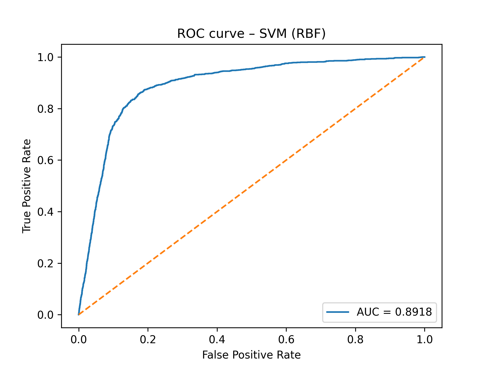
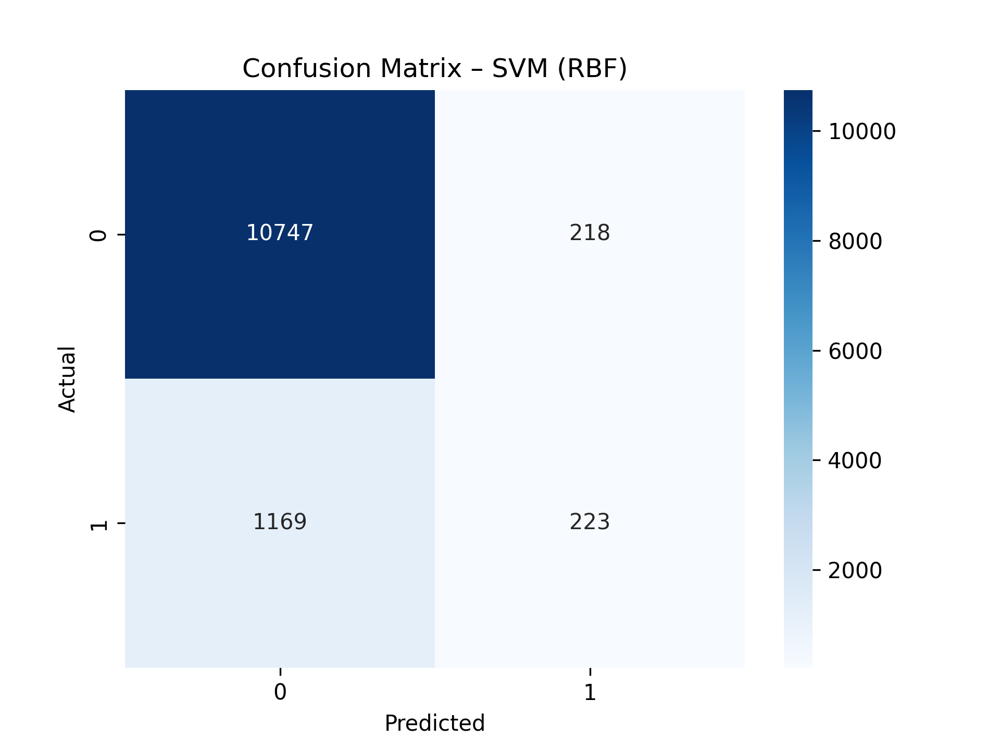
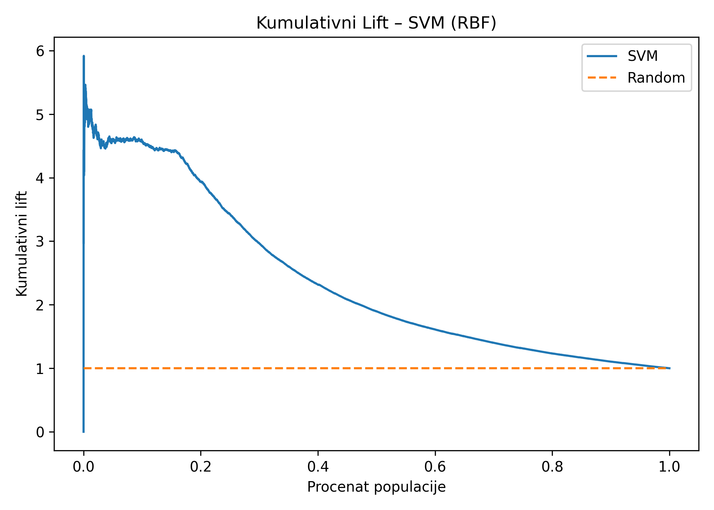

# Reprodukcija SVM modela za predviđanje uspešnosti bankarskih telemarketing kampanja

**Student:** *Aleksandar Vasilic*

**Predmet:** *Masinsko učenje*

**Godina:** 2026

---

## 1. Uvod

Cilj ovog projekta je reprodukcija i evaluacija modela zasnovanog na Support Vector Machine (SVM) algoritmu za
predviđanje uspešnosti bankarskih telemarketing kampanja, u skladu sa pristupom predloženim u radu:

**A data-driven approach to predict the success of bank telemarketing**

autora
**Sérgio Moro**,
**Paulo Rita** i
**Paulo Cortez**.

Problem je formulisan kao problem binarne klasifikacije, gde je ciljna promenljiva informacija o tome da li je klijent
prihvatio ponudu oročenog depozita.

U ovom projektu koristi se samo jedan model – SVM klasifikator sa nelinearnim RBF kernelom.

---

## 2. Skup podataka

Eksperimenti su sprovedeni nad skupom podataka *Bank Marketing*, koji je javno dostupan na repozitorijumu
**UCI Machine Learning Repository**.

Ciljna promenljiva je:

* `y ∈ {yes, no}`

gde vrednost `yes` označava da je klijent prihvatio ponudu oročenog depozita.

Skup podataka sadrži **41188 instanci** sa **20 ulaznih atributa** (10 numeričkih i 10 kategorijalnih) i jednim izlaznim
atributom, organizovanih u četiri grupe:

* **informacije o klijentu** – starost, zanimanje, bračno stanje, obrazovanje, kreditna zaduženost, stambeni i lični
  kredit,
* **poslednji kontakt u okviru kampanje** – tip komunikacije, mesec, dan u nedelji i trajanje poziva,
* **ostali atributi kampanje** – broj kontakata u tekućoj i prethodnim kampanjama, ishod prethodne kampanje,
* **socio-ekonomski pokazatelji** – stopa varijacije zaposlenosti, indeks potrošačkih cena, indeks poverenja potrošača,
  tromesečni EURIBOR i broj zaposlenih.

Kategorijalni atributi sadrže nedostajuće vrednosti kodirane kao `"unknown"`, koje su u ovom projektu tretirane kao
zasebna kategorija (implicitno putem `OneHotEncoder`-a).

> **Napomena o atributu `duration`:** Prema dokumentaciji skupa podataka, atribut `duration` (trajanje poslednjeg
> poziva) značajno utiče na ciljnu promenljivu i ne bi trebalo da se koristi u realističkom prediktivnom modelu, jer
> njegova vrednost nije poznata pre obavljanja poziva. U ovom projektu atribut je **zadržan** radi reprodukcije
> rezultata
> iz referentnog rada i korišćen je u benchmark svrhe.

U ovom projektu korišćen je fajl:

```
bank-additional-full.csv
```

---

## 3. Pretprocesiranje podataka

Pre treniranja modela primenjeni su sledeći koraci obrade podataka:

* kategorijalne promenljive transformisane su primenom one-hot enkodiranja,
* numeričke promenljive su standardizovane na nultu srednju vrednost i jediničnu standardnu devijaciju,
* ciljna promenljiva je kodirana na sledeći način:

    * `yes → 1`
    * `no → 0`.

Standardizacija je primenjena isključivo na numeričke atribute, što je u skladu sa preporukama za SVM modele.

Podaci su podeljeni na trening i test skup korišćenjem stratifikovane podele (`random_state=42`):

* trening skup: 70%
* test skup: 30%.

---

## 4. Model

U ovom radu korišćen je Support Vector Machine klasifikator sa RBF kernelom.

Konfiguracija modela je sledeća:

* kernel: RBF
* C = 3
* γ = 2⁻⁰·⁷⁸ ≈ 0.5824

Navedene vrednosti hiperparametara preuzete su iz referentnog rada, gde su dobijene postupkom pretrage mreže
parametara (grid search).

Model je implementiran korišćenjem klase `sklearn.svm.SVC`.

---

## 5. Postupak učenja

Model je treniran isključivo na trening skupu.

Podaci su podeljeni na trening (70%) i test (30%) skup korišćenjem stratifikovane podele (`stratify=y`,
`random_state=42`), čime je obezbeđen balansiran odnos klasa u oba skupa.

U implementaciji je korišćen `Pipeline` koji se sastoji od sledećih koraka:

1. one-hot enkodiranje kategorijalnih atributa (`OneHotEncoder`),
2. standardizacija numeričkih atributa (`StandardScaler`),
3. treniranje SVM klasifikatora (`SVC`).

Omogućeno je računanje verovatnoća pripadnosti klasi (`probability=True`) kako bi bilo moguće izračunavanje ROC krive,
AUC mere i kumulativnog lift grafikona.

Za vizualizaciju matrice konfuzije korišćena je biblioteka `seaborn`.

---

## 6. Metrike evaluacije

Performanse modela procenjene su na test skupu pomoću sledećih metrika:

* Accuracy
* ROC AUC.

Pored numeričkih rezultata, prikazani su i sledeći grafički prikazi:

* ROC kriva,
* matrica konfuzije,
* kumulativni lift grafikon.

---

## 7. Eksperimentalni rezultati

### 7.1 Numerički rezultati

| Metrika  | Vrednost   |
|----------|------------|
| Accuracy | **0.8878** |
| ROC AUC  | **0.8918** |

Vreme izvršavanja: **2.33 minuta**.

---

### 7.2 ROC kriva

Na slici je prikazana ROC kriva dobijena za SVM model sa RBF kernelom.



---

### 7.3 Matrica konfuzije

Matrica konfuzije dobijena na test skupu prikazana je na slici:



---

### 7.4 Kumulativni lift grafikon

Na slici je prikazan kumulativni lift grafikon koji pokazuje koliko je model bolji od nasumičnog izbora pri rangiranju
klijenata prema verovatnoći prihvatanja ponude.



---

## 8. Poređenje sa referentnim radom

U referentnom radu SVM model je treniran korišćenjem nelinearnog RBF kernela, pri čemu su hiperparametri birani pomoću
grid-search postupka.

Prijavljene optimalne vrednosti su:

* C = 3
* γ̂ = 2⁻⁰·⁷⁸.

U ovom projektu korišćene su iste vrednosti hiperparametara.

Dobijeni rezultati nalaze se u istom opsegu kao rezultati prikazani u referentnom radu. Manja odstupanja u vrednostima
metrika mogu se objasniti sledećim faktorima:

* drugačijom podelom podataka na trening i test skup,
* drugačijom softverskom implementacijom algoritma,
* razlikama u internim optimizacionim procedurama.

U referentnom radu SVM model je treniran korišćenjem SMO algoritma, dok se u ovom projektu koristi implementacija iz
biblioteke scikit-learn zasnovana na libsvm biblioteci.

---

## 9. Diskusija

Dobijeni rezultati pokazuju da SVM klasifikator sa RBF kernelom ostvaruje visoke performanse u zadatku predviđanja
uspešnosti telemarketing kampanja.

Visoka vrednost ROC AUC mere ukazuje na dobru sposobnost modela da razdvoji klijente koji će prihvatiti ponudu od onih
koji je neće prihvatiti, uprkos prisutnoj neuravnoteženosti klasa u skupu podataka.

---

## 10. Zaključak

U ovom projektu uspešno je reprodukovan eksperiment zasnovan na SVM modelu iz referentnog rada, korišćenjem istog skupa
podataka i slične metodologije obrade podataka.

Rezultati potvrđuju da SVM sa RBF kernelom predstavlja efikasan pristup za modelovanje uspešnosti bankarskih
telemarketing kampanja.
